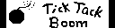
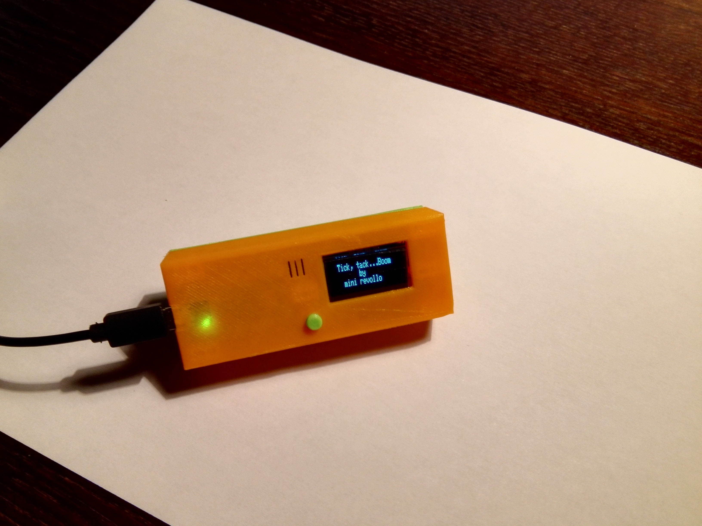
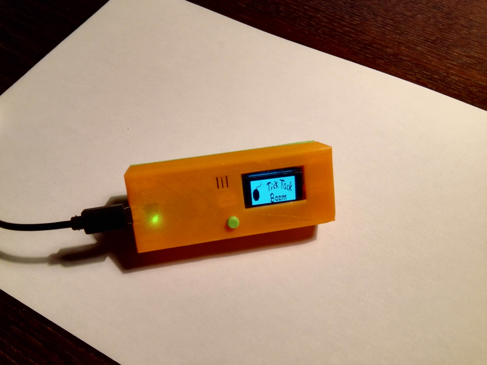
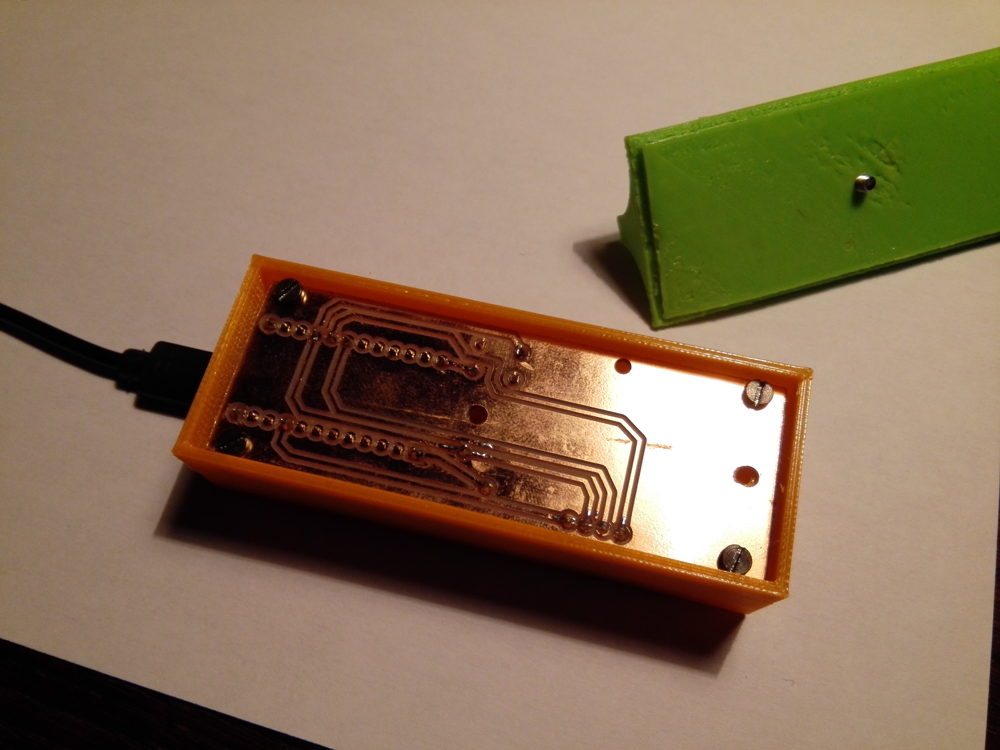
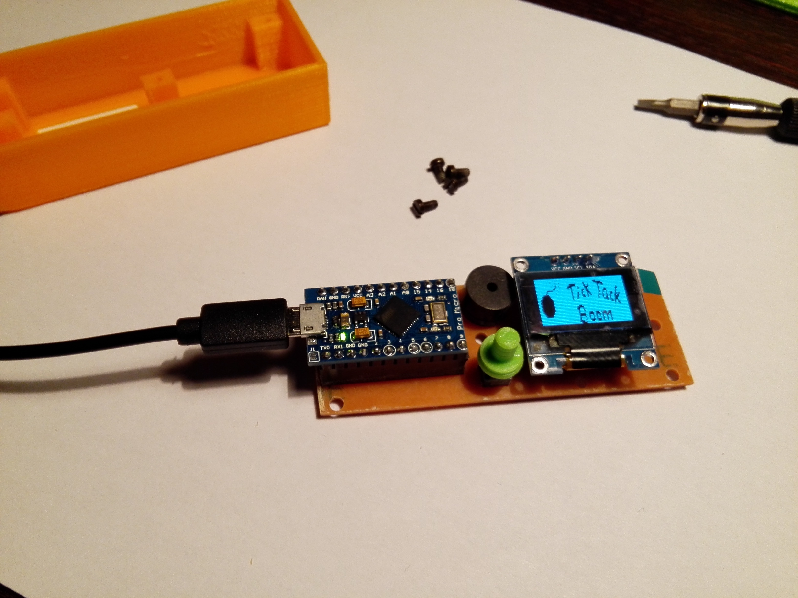
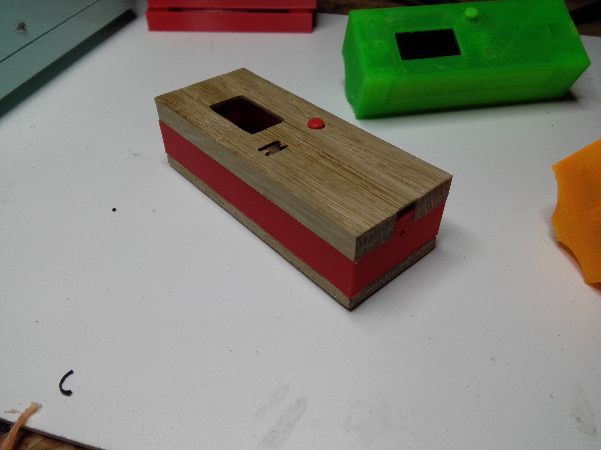
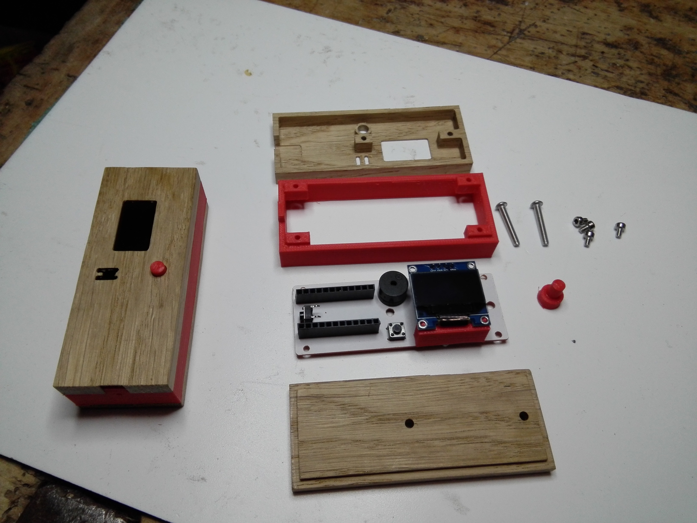
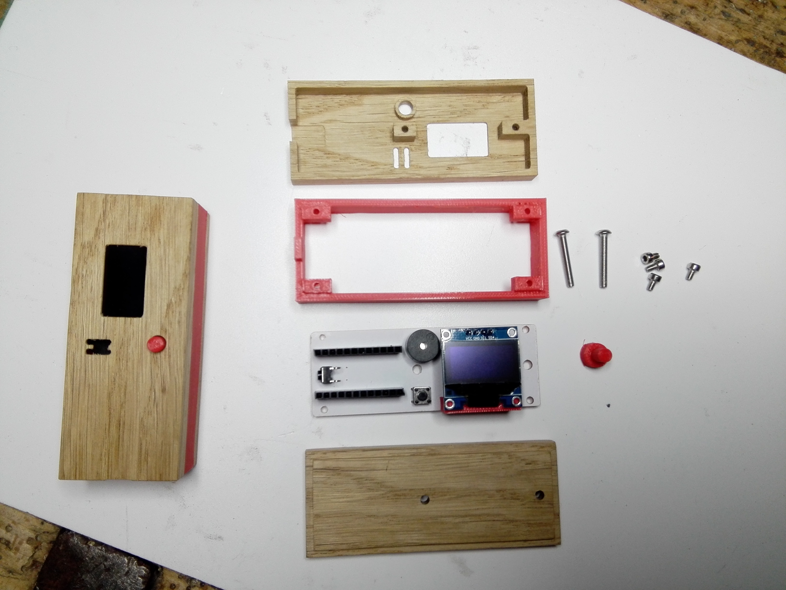

#  #TICK, TACK ...BOOM

Ein Ratespiel, ähnlich Stadt, Land, Fluss. Die Spielanleitung gibt es unter IMG/Spielanleitung.

 

Für den Arduino mit nur ein paar Bauteilen.

## Hardware ##
- Arduino (z. B. pro micro)
- OLED-Display 128 x 32 Pixel
- Buzzer passiv
- Button
- LED  (eignebaut)

Anschluß des Displays über I2C an die Pins SDA und SCL (beim Arduino UNO SDA = A4 und SCL = A5 für andere Arduinos bitte den PinOut-Plan beachten).
Der Button kommt auf Pin 7 und GND.
Der Buzzer zwischen Pin 11 und GND. 
Für die LED habe ich die eingbaute auf Pin 13 verwendet.

     

## Software ##
Arduino-Code über die Arduino-IDE aufspielen.Für absolute Anfänger hier der Link zu [ARDUINO](https://www.arduino.cc/).
Ihr benötigt noch zwei Bibliotheken von [Adafruit](http://www.adafruit.com/):
- Adafruit_GFX.h
- Adafruit_SSD1306.h
- und die entsprechenden .cpp-Dateien

Diese müssen unter dem Ordner 
... C:\Program Files (x86)\Arduino\libraries\Adafruit  abgelegt sein.

Man könnte auch andere OLED-Bibliotheken verwenden. Der Programmcode müsste dann entsprechend angepasst werden. 

Die Daten für den Startbildschirm "Tick Tack Boom" habe ich in meiner Adafruit_SSD1306.cpp Datei hinterlegt. 

Hier liegen normalerweise die Daten für das Adafruit-Logo. Diese Daten habe ich mit meinen Daten ersetzt. Um ein eigenes Logo zu gestalten, erzeuge mit einem Grafikprogramm (z.B. Paint) eine Gif-Datei 128 x 32 Pixel mit euerem gewünschten Motiv. Auf der Website http://www.majer.ch/lcd/adf_bitmap.php kann diese Datei dann in HEX-Daten umgewandelt werden. Die Daten kopieren und die Daten für das Adafruit-Logo damit überschreiben.

Der Code ist so ausgelegt, das für jeden Spielmodus 29 Werte hinterlegt sind. Wenn noch mehr Werte gewünscht sind, müssen die entsprechenden arrays t, b und g entsprechend erweitert werden.

## Gehäuse 

Es wurden zwei Gehäusetypen von mir konstruiert. Zum Einen das komplett 3D-gedruckte Gehäus. Bestehend aus einer Bodenplatte mit Wölbung. Gedacht für zwei zylinderförmige Powerbanks mit einem Durchmesser von ca. 22 mm. Zu befestigen mit zwei dicken Gummibändern. Und dem Oberteil. Innen benötigt man noch eine Stütze für das Display und die Buttonverlängerung. 

     

  

Für meine Freundin habe ich dann noch die Edelvariante mit Eichenholz und rotem Filament produziert. Der mittlere Teil, die Displaystütze und der Button wurde wieder 3D-gedruckt. Der Deckel und das Unterteil wurde mit einer Othermill gefräst. Hierfür wurde aus der aus Sketchup exportierten DXF-Datei mit [ESTLCAM](http://www.estlcam.de) eine .tap-Datei (g-code) 
erzeugt. 

An dieser Stelle nochmal vielen Dank an Christian, den Programmierer von ESTLCAM, der dem erfindergarden eine Lizenz zur Verfügung gestellt hat.

     

 

## Platine: ##

Die Platine wurde mit Fritzing gebaut. Export als Gerber-File. Gefräst wieder mit der Othermill.

